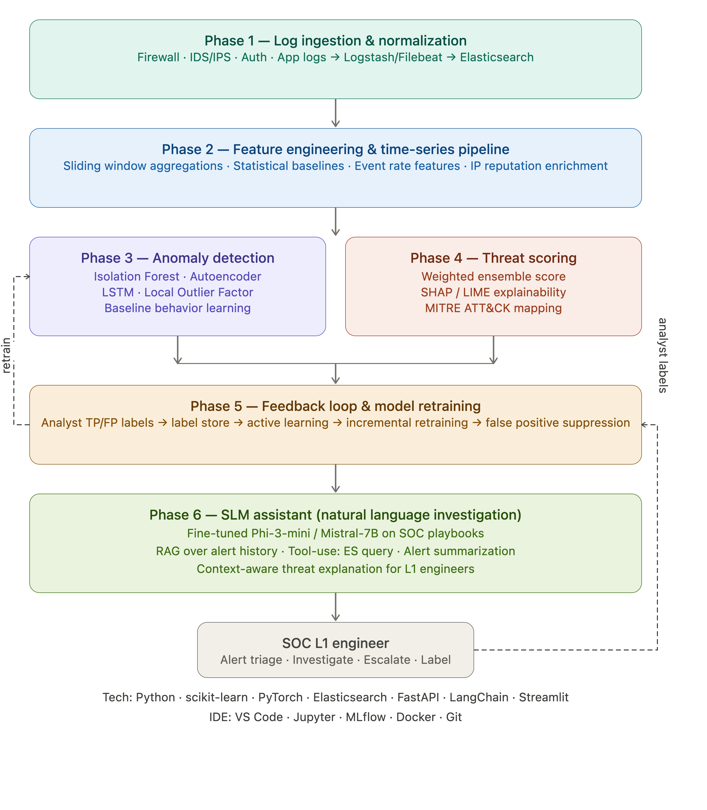

## IDE & General Setup

Use **VS Code** as your primary IDE with the Python, Pylance, Jupyter, and Docker extensions. Keep **Jupyter notebooks** for experimentation and prototyping each phase, then graduate stable code to `.py` modules. Use **Git** from day one, even if it's just a local repo.

---

## Phase 1 — Elasticsearch Integration, Log Ingestion, Normalization

**Libraries:** `elasticsearch-py`, `python-dotenv`, `logstash` (via pipeline config), `Filebeat` (agent-side)

**Approach:**
- Deploy a local Elasticsearch + Kibana stack via Docker Compose
- Use Filebeat/Logstash pipelines to ship logs (syslog, CEF, JSON) into ES indices
- Write a Python ingestion layer using `elasticsearch-py` with index templates and mappings for normalization (timestamp standardization, IP parsing, event type tagging)
- Normalize fields to a common schema like ECS (Elastic Common Schema)

---

## Phase 2 — Feature Engineering & Time-Series Pipeline

**Libraries:** `pandas`, `numpy`, `scikit-learn` (preprocessing), `elasticsearch-dsl`

**Approach:**
- Build sliding window aggregators: events-per-minute per source IP, unique destination ports per user, login failure rates
- Enrich with external context: IP reputation via `ipwhois` or a local blocklist lookup
- Output feature vectors as pandas DataFrames, persisted back to ES or to a feature store (start simple with Parquet files, scale to `Feast` later)
- Build a scheduled pipeline using `APScheduler` or Airflow (simple DAG)

---

## Phase 3 — Anomaly Detection Models & Baseline Learning

**Libraries:** `scikit-learn` (IsolationForest, LocalOutlierFactor), `PyTorch` or `TensorFlow/Keras` (Autoencoder, LSTM), `PyOD` (library specifically for anomaly detection — highly recommended)

**Approach:**
- Start with `Isolation Forest` for unsupervised anomaly detection (fast, interpretable baseline)
- Add an `Autoencoder` (PyTorch) for reconstruction-error-based anomaly scoring on high-dimensional log features
- Use `LSTM` for time-series sequence anomalies (e.g., unusual command sequences, login patterns)
- Build a **baseline learner**: compute rolling mean/std per entity (user, IP, service) over a 7-day window; flag deviations beyond N standard deviations
- Track experiments with **MLflow**

---

## Phase 4 — Threat Score Engine & Explainability

**Libraries:** `shap`, `lime`, `scikit-learn` (ensemble), `mitreattack-python`

**Approach:**
- Combine anomaly scores from multiple models into a weighted ensemble threat score (0–100)
- Use **SHAP** to generate per-alert feature importance — this is your explainability layer ("Alert triggered because: login failures spiked 8× above baseline from IP X")
- Map detected patterns to **MITRE ATT&CK** tactics/techniques using `mitreattack-python` library
- Store scored alerts back into Elasticsearch with threat score, top contributing features, and MITRE tags

---

## Phase 5 — Feedback Loop & Model Retraining

**Libraries:** `scikit-learn` (partial_fit for incremental learning), `MLflow`, `optuna` (hyperparameter tuning), `SQLite` or `PostgreSQL` (label store)

**Approach:**
- Build a simple label store: analysts mark alerts as True Positive / False Positive via the UI
- Feed labeled data into an **active learning loop** — prioritize alerting on borderline anomaly scores where analyst input has most value
- Retrain models on a schedule (weekly) using the accumulated labeled dataset combined with the original training data
- Version models with **MLflow Model Registry** so you can roll back
- Implement **false positive suppression** rules derived from FP patterns (e.g., "scanner IP X always triggers at 2AM — suppress")

---

## Phase 6 — SLM Integration & Natural Language Investigation

**Libraries/Models:** `transformers` (HuggingFace), `LangChain`, `llama-index`, `sentence-transformers`, `Chroma` or `FAISS` (vector store)

**Approach:**
- Fine-tune a small LM — **Phi-3-mini** (3.8B, fast) or **Mistral-7B** — on SOC playbooks, MITRE descriptions, and historical alert summaries using QLoRA (`peft` + `bitsandbytes`)
- Build a **RAG pipeline** over your alert history: embed alerts → store in Chroma → retrieve relevant past incidents for context
- Give the SLM **tool use**: it can call ES queries to pull raw log evidence when answering analyst questions
- Build the chat interface with **Streamlit** (fast) or a FastAPI + React frontend
- Example L1 query: *"Why was alert #4521 raised? Is this a real threat?"* → SLM retrieves the alert, SHAP features, similar historical cases, and explains in plain English

---

## Full Tech Stack Summary

| Layer | Tools |
|---|---|
| Log shipping | Filebeat, Logstash |
| Storage | Elasticsearch 8.x, Kibana |
| Data pipeline | Python, pandas, APScheduler |
| ML / anomaly | scikit-learn, PyOD, PyTorch, SHAP, LIME |
| Experiment tracking | MLflow |
| SLM | HuggingFace Transformers, LangChain, Chroma, Phi-3-mini |
| API layer | FastAPI |
| UI | Streamlit (prototype) → React (production) |
| Infra | Docker Compose, Git |
| IDE | VS Code + Jupyter |

---

## Recommended Build Order

Start with Phase 1+2 together since you need real data flowing before any model makes sense. Get Elasticsearch running locally with Docker, ingest some sample security logs (you can use public CICIDS2017 or UNSW-NB15 datasets to bootstrap before real ISRO logs), and build your feature pipeline. Phase 3 follows naturally once you have clean feature vectors. Phase 6 (the SLM) can be prototyped in parallel early on using an API call to a hosted model, then replaced with the fine-tuned version in the final sprint.

The feedback loop (Phase 5) is architecturally the most important piece for long-term value — design the label schema and storage from the very beginning, even if the retraining automation comes later.
