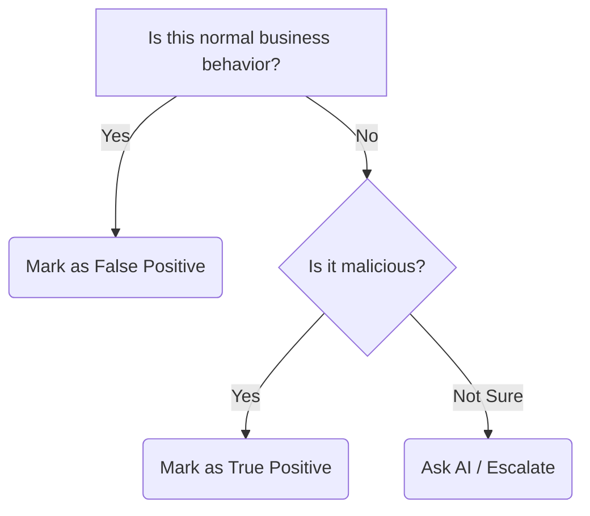

# ISRO ISTRAC SOC Platform — Analyst User Manual

## Welcome
Welcome to the ISRO ISTRAC Security Operations Center! This platform helps you detect, investigate, and respond to security threats faster using AI assistance. 

Unlike older security tools that rely entirely on rigid rules (which create too many false alarms), this platform learns what is "normal" for our network. It points out strange behaviors and helps you understand *why* they are strange. This guide covers everything you need to know for your day-to-day operations.

---

## Getting Started

### Logging In
1. Navigate to the SOC portal at `https://soc.istrac.isro.gov.in`.
2. Enter your assigned Analyst credentials.
3. If prompted, complete the Two-Factor Authentication (2FA) challenge.

*(Insert Login Screenshot Here)*

### Understanding the Dashboard
When you log in, you will land on the main Dashboard. Think of this as your "command center."
- **Total Open Alerts**: The number of unprocessed security alarms.
- **Critical / High / Medium / Low**: Alerts are grouped by severity. Always tackle Critical and High alerts first!
- **Threat Level Colors**: 
  - 🔴 **Red (Critical)**: Immediate action required.
  - 🟠 **Orange (High)**: Investigate as soon as possible.
  - 🟡 **Yellow (Medium)**: Investigate during your shift.
  - 🔵 **Blue (Low)**: Likely benign, review when time permits.
- **Top Targeted Hosts**: Identifies which servers or computers on the network are currently under the heaviest attack.

---

## Your Daily Workflow

### Step 1: Check the Dashboard
First thing in your shift, look at the top stat cards. Are there any **Critical** alerts waiting? Look at the "Top Targeted Hosts" panel. Is a specific database server suddenly lighting up with warnings? This gives you an immediate sense of the network's weather.

### Step 2: Review the Alert Queue
Navigate to the **Alerts** tab. This is where you will spend most of your time.
- **Filters**: Use the drop-down menus to filter for "Open" status and "Critical/High" threat levels.
- **Sort Order**: By default, alerts are sorted by their Threat Score (highest first).
- **Workbench Mode**: If you want a distraction-free, full-screen view to power through alerts quickly, click the "Workbench Mode" toggle at the top right.

### Step 3: Investigate an Alert
Click on any alert in the queue to open its details. Don't panic if you see complex data! 
1. **Read the SHAP Explanation**: The platform highlights exactly *why* it flagged this alert. For example, it might say "Network traffic was 5x higher than normal for this user."
2. **Check MITRE Context**: Look at the MITRE tags. Is this categorized as "Initial Access" (someone trying to break in) or "Data Exfiltration" (someone stealing data)?
3. **Use the AI Investigation Assistant**: On the right side of the screen, you have a chatbox. You can ask the AI, "Can you explain this alert to me?" or "Have we seen this type of attack on this server before?" 

### Step 4: Make a Triage Decision
Once you understand what happened, you must tell the system if the alert is real. 

- **True Positive (TP)**: This is a real attack or policy violation.
- **False Positive (FP)**: The AI made a mistake; this is normal behavior (e.g., a system administrator running a backup script).
- **Benign**: It's not normal, but it's not an attack either (e.g., a misconfigured printer sending bad packets).

**Why your feedback matters**: Every time you click "False Positive," the AI learns. Next week, when that same admin runs their backup script, the AI will stay quiet. Your feedback trains the system!

### Step 5: Escalate if Needed
If an alert is a True Positive and requires immediate blocking, or if you are unsure and need a senior engineer's help:
1. Click the **Escalate** button.
2. Select the L2 Team or Incident Response team.
3. Write a brief note explaining *why* you are escalating (e.g., "Confirmed unauthorized login from a foreign IP. Needs immediate account lockout.").

### Step 6: End of Shift
Before you log off, go to the **Reports** tab and click **Generate Shift Report**. This creates a clean summary of how many alerts you closed, any incidents you escalated, and outstanding items to hand off to the next analyst.

---

## Using the AI Assistant (SLM Chat)
The AI Assistant acts like a senior analyst sitting next to you. It has read all past alerts and understands the network.

**What it CAN do:**
- Summarize complex logs into plain English.
- Tell you if a similar alert has happened in the past month.
- Suggest next steps to investigate.

**What it CANNOT do:**
- It cannot block IP addresses or lock user accounts.
- It cannot guarantee 100% accuracy.

**Example Good Questions:**
- "What does this specific PowerShell command do?"
- "Is this IP address internal or external?"
- "Have we seen an incident involving 'mimikatz' recently?"

**How to Read Responses:**
The AI structures its answers into **Summary**, **Evidence**, and **Action**. 
*Trust but verify!* The AI is here to assist you, but YOU are the security expert making the final call.

---

## Understanding Threat Scores
Every alert gets a score from 0 to 100.
- **0–30 (Low)**: Very slight deviations from normal.
- **30–60 (Medium)**: Unusual behavior, but often benign anomalies.
- **60–80 (High)**: Strong statistical anomalies or matching known threat patterns.
- **80–100 (Critical)**: Near certainty of malicious activity (e.g., a known virus signature + unusual network behavior).

**Model Consensus**: The system uses multiple "brains" (models). If Model A says "this looks bad" but Model B says "this looks normal," the threat score is lowered. If *both* models agree it looks bad, the score spikes. Consensus means high confidence.

---

## Understanding MITRE ATT&CK in This Platform
MITRE ATT&CK is a dictionary of hacker behaviors. 
- **Tactics**: The *Goal* of the hacker (e.g., "Steal Credentials").
- **Techniques**: *How* they achieve the goal (e.g., "Brute Force Password Guessing").

If you see a technique ID like `T1003` (OS Credential Dumping) and don't know what it means, click the badge in the UI. A side panel will pop out explaining the technique in plain English.

---

## Working with Incidents
- **Alert**: A single suspicious event (e.g., 5 failed logins).
- **Incident**: A connected story of multiple alerts (e.g., 5 failed logins, followed by a successful login, followed by a massive file download).

When viewing an Incident, look at the **Attack Chain Timeline**. It visually connects the dots so you can see how an attacker moved through the network step-by-step. If an incident is marked **Multi-Stage**, it means the attacker is progressing through their goals. These are extremely high priority.

---

## Keyboard Shortcuts (Workbench Mode)
To speed up your workflow in the Alert Queue Workbench:
- `j` : Move to next alert down
- `k` : Move to previous alert up
- `t` : Mark current alert as True Positive
- `f` : Mark current alert as False Positive
- `e` : Open Escalate dialog
- `?` : Open this help menu

---

## Frequently Asked Questions

**"Why did the AI flag this as critical when it looks normal to me?"**
The AI can see hidden patterns you might miss, like the exact millisecond timing of network packets. Read the "SHAP Explanation" on the alert page—it will tell you exactly which hidden feature caused the high score.

**"What if I disagree with the threat score?"**
That is your job! If the score is 95 but you know it's a False Positive, mark it as a False Positive. The AI will learn from your correction.

**"How do I know if my feedback actually improved the system?"**
Models are retrained every Sunday morning. You will notice that the noisy alerts you suppressed all week will stop appearing on Monday.

**"What do I do if the AI assistant gives a wrong answer?"**
Use the thumbs-down 👎 button on the chat message. This flags the conversation for the platform engineers to review and fix.

**"Can I undo a triage decision?"**
Yes. In the Alerts tab, change your filter to "Closed" alerts, click the alert you accidentally closed, and update its status back to "Open."

---

## Glossary for Analysts

- **SOC**: Security Operations Center. The team monitoring the network.
- **SIEM**: Security Information and Event Management. The software that collects the logs (this platform).
- **IOC**: Indicator of Compromise. A hard clue left by a hacker, like a bad IP address or file hash.
- **RAG**: Retrieval-Augmented Generation. The technology that allows the AI Assistant to read historical alerts before answering your questions.
- **SHAP**: Shapley Additive Explanations. The math that translates a complex AI decision into the plain-English bullet points you see on the screen.
- **Entity**: A user or a computer on the network.
- **Lateral Movement**: When a hacker breaks into one computer and tries to jump to another computer on the same network.
