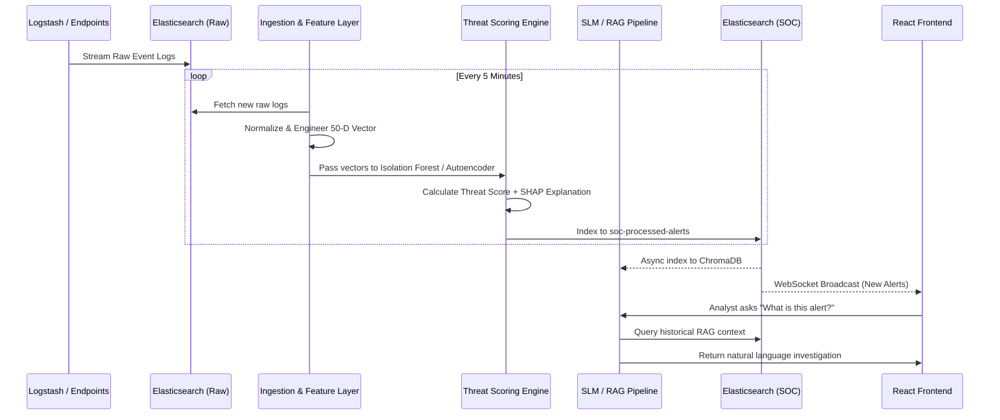

# ISRO ISTRAC SOC AI Platform — System Architecture

## 1. Executive Summary

The ISRO ISTRAC Security Operations Center (SOC) AI Platform is a modern, intelligence-driven SIEM designed to protect critical aerospace network infrastructure. It ingests high-velocity system, network, and process logs in near real-time, leveraging an ensemble of machine learning models to detect subtle anomalous behaviors that traditional signature-based rules miss. By combining unsupervised anomaly detection with deterministic rules, the platform dramatically reduces alert fatigue while highlighting genuine zero-day threats and lateral movement.

Beyond detection, the platform accelerates analyst response via an integrated Small Language Model (SLM) assistant. This agent uses Retrieval-Augmented Generation (RAG) to cross-reference real-time incidents against historical context and MITRE ATT&CK patterns, offering explainable, plain-English insights into complex attack chains. The platform continuously learns from analyst feedback, ensuring the threat models stay calibrated to the evolving landscape of the ISRO infrastructure.

---

## 2. System Components

### 2.1 Data Ingestion Layer
The data ingestion pipeline provides the asynchronous backbone for the SOC platform, pulling raw data from Elasticsearch indices generated by external Logstash agents.
- **Log Fetcher**: The `log_fetcher.py` connects to multiple indices (`syslog`, `process`, `security`) via asynchronous Elasticsearch cursors, retrieving windows of raw log events.
- **Normalizer**: The `normalizer.py` coerces disparate log structures (e.g., Windows Event Logs vs. Linux Syslogs) into standardized internal data classes.
- **Scheduler**: An `APScheduler` loop governs the entire cycle natively in `scheduler.py`, guaranteeing that new logs are ingested, enriched, and pushed to the pipeline precisely every 5 minutes.

### 2.2 Feature Engineering Layer
Before logs can be scored by ML models, they must be transformed into continuous numeric vectors.
- **Extractors**: Domain-specific extractors calculate properties like `process_tree_depth`, `connection_velocity`, and `entropy` of command-line arguments.
- **Feature Merger**: The `feature_merger.py` aggregates network and process behaviors per unique `entity_key` (combining host and user) into a rigid 50-dimensional vector. This normalization ensures robust model training.

### 2.3 ML Detection Layer
The platform avoids over-reliance on a single algorithm by using an ensemble approach managed by `ModelManager`.
- **Isolation Forest**: Primarily scores network-level features (12 dimensions). Detects generalized outliers like port scanning and abnormal data exfiltration.
- **Autoencoder**: A PyTorch-based neural network trained on process behaviors (14 dimensions). By learning the "normal" manifold of process execution, it detects living-off-the-land attacks based on high reconstruction error.
- **LSTM (Experimental)**: Evaluates the sequence of event actions to determine temporal perplexity.
- **Rule Engine**: Acts as a deterministic backstop. Catches explicitly forbidden commands (e.g., `mimikatz`, `whoami` chains) and immediately flags them regardless of ML confidence.

### 2.4 Scoring & Explainability Layer
- **Threat Engine**: Normalizes the raw anomaly scores outputted by the Isolation Forest and Autoencoder, combining them with Rule Engine modifiers to calculate a final normalized `threat_score` (0.0 to 1.0).
- **SHAP Integrations**: The `explainability_engine.py` applies Shapley Additive Explanations to generate human-readable context regarding *why* an alert scored highly, attributing weight to specific features (e.g., "Network velocity was 5x the baseline").
- **Calibration**: Dynamic thresholding limits the generation of "High" and "Critical" alerts to extreme statistical outliers, controlling the funnel.

### 2.5 Correlation & Pattern Layer
- **Alert Correlator**: Raw alerts are logically grouped by time, host, and user. If multiple high-severity alerts strike the same host within a brief window, they are promoted into a unified `Incident`.
- **Pattern Detector**: Analyzes graphs of incidents to assign MITRE ATT&CK tactics (e.g., identifying a transition from *Initial Access* to *Lateral Movement*).
- **Baseline Profiling**: The system tracks the typical average/standard deviation of traffic for every host (`soc-entity-baselines`), detecting shifts over time.

### 2.6 Feedback & Learning Layer
- **Feedback Loop**: Through the UI, analysts label alerts as True Positives, False Positives, or Benign.
- **Label Store & Active Learner**: The `feedback_manager.py` persists these labels. A background Retraining Job leverages `Trainer` to update the models weekly using the latest labeled data, ensuring false positive patterns (like new backup scripts) are learned and suppressed.
- **Drift Detector**: Computes statistical divergence (e.g., Kolmogorov-Smirnov test) between training and inference distributions. Triggers automated alerts if the baseline environment changes significantly.

### 2.7 SLM Investigation Layer
- **SLM Engine**: A lightweight fine-tuned Phi-3-mini language model resides locally (`model_loader.py`).
- **Conversation Manager**: Handles chat turn history, context windows, and TTL (Time-to-Live) eviction.
- **RAG Pipeline**: Embeds previous alerts using `all-MiniLM-L6-v2` into a local ChromaDB. When an analyst asks a question, the SLM is enriched with semantic similarities to previous attacks, enabling it to say "This looks like the brute force attempt we saw on Server X last Tuesday."

### 2.8 Frontend Application
- **React/Vite Architecture**: A high-performance SPA using functional components and React Hooks.
- **Real-time Layer**: WebSocket integration pushes live `stats_update` and new alerts directly into the Redux/Context state.
- **Visualizations**: Tailwind CSS for structural styling alongside Recharts/D3 for correlation graphs, SHAP waterfalls, and attack trees.

---

## 3. Data Flow (End-to-End)



---

## 4. Index Schema Reference

| Index Name | Purpose | Key Fields |
|---|---|---|
| `logs-system.syslog-*` | Raw OS system logs | message, timestamp, host.name |
| `logs-endpoint.events.process-*` | Raw endpoint process telemetry | process.name, process.args, user.name |
| `logs-windows.powershell_operational-*` | Raw PS execution logs | event.code, powershell.script_block |
| `soc-processed-alerts` | The core normalized alerts after ML scoring | threat_score, threat_level, shap_features, entity_key, mitre_tactic |
| `soc-feature-vectors` | Numeric representations for ML retraining | feature_vector (50 dims), entity_type |
| `soc-analyst-feedback` | Ground truth labels from SOC engineers | alert_id, label (TP/FP/Benign), analyst_name |
| `soc-incidents` | Correlated groups of alerts | incident_id, alert_ids, status, attack_stage |
| `soc-entity-baselines` | Rolling statistical averages per host | entity_key, avg_conn_per_minute, known_process_names |
| `soc-audit-logs` | Tracks all modifications to the platform | action, admin_user, target_resource |
| `soc-score-history` | Time-series data for sparkline graphs | timestamp, entity_key, threat_score |

---

## 5. ML Model Specifications

| Model | Type | Input | Output | Training Data | Retrain Frequency |
|-------|------|-------|--------|---------------|-------------------|
| **Isolation Forest** | Unsupervised | Network features (12) | Anomaly score 0-1 | 7-day rolling | Weekly + drift-triggered |
| **Autoencoder** | Unsupervised | Process features (14) | Reconstruction error | 7-day rolling | Weekly + drift-triggered |
| **LSTM** | Sequence | Event action sequences | Perplexity score | 7-day rolling | Weekly |
| **Rule Engine** | Deterministic | All features | Binary + score | N/A (hand-coded) | Manual |
| **SLM (Phi-3-mini)**| Generative | Text prompts | Natural language | Fine-tune dataset | Manual |

---

## 6. Security Architecture
The platform handles highly sensitive telemetry and adheres to strict security constraints:
- **Authentication**: JWT-based Bearer authentication. Tokens expire within 60 minutes.
- **RBAC Matrix**: Enforced natively at the FastAPI endpoint layer. Roles include `Admin`, `Analyst`, and `Viewer`. (e.g. Only `Admin` can trigger ML retraining, `Analyst` can resolve incidents).
- **Encryption**: TLS 1.3 in transit via Uvicorn/Nginx. Elasticsearch indices rely on hardware-level disk encryption at rest.
- **Audit Logging**: A dedicated `AuditMiddleware` captures every state-changing API request (`POST`, `PUT`, `DELETE`), indexing the caller IP, user, and payload into `soc-audit-logs`.

---

## 7. Scalability Considerations
- **Current Capacity**: The single-node FastAPI architecture easily handles the target 1,000 EPS (Events Per Second) via batch async ingestion.
- **Bottlenecks**: Neural network inference (Autoencoder) and the SLM engine are the primary CPU locks. 
- **Horizontal Scaling**: The architecture is fully stateless. The FastAPI instances can be replicated endlessly via a load balancer. The SLM can be decoupled into a dedicated GPU-bound microservice container if query volume increases.

---

## 8. Technology Stack

| Domain | Technology | Purpose |
|---|---|---|
| **Backend Framework** | FastAPI (Python 3.11) | High-performance async API and WebSocket server |
| **Data Lake** | Elasticsearch 8.x | High-velocity log storage and full-text search |
| **Machine Learning** | Scikit-Learn, PyTorch | Unsupervised models (Isolation Forest, Autoencoder) |
| **Vector DB** | ChromaDB | Local embedded storage for RAG pipeline |
| **Generative AI** | HuggingFace (Transformers) | Running Phi-3-mini locally for the assistant |
| **Frontend Framework** | React 18, Vite | Component-based UI and blazing fast compilation |
| **Frontend Styling** | Tailwind CSS, Lucide | Utility-first design and SVG iconography |
| **Background Jobs** | APScheduler | Managing 5-minute ingestion and weekly retrain cycles |
| **Testing** | Pytest, Playwright | Backend unit coverage and frontend E2E/Accessibility |

---

## 9. Deployment Topology
The system runs via Docker Compose in staging and Kubernetes in production.

```text
[ Internet / Intranet ] 
         │
         ▼
[ Nginx Reverse Proxy (TLS Termination) ]
         │
         ├──────────────────────┐
         ▼                      ▼
[ Frontend (React/Vite) ]  [ Backend (FastAPI :8000) ]
                                │
   ┌────────────────────────────┼─────────────────────────────┐
   ▼                            ▼                             ▼
[ ML Models (.pkl/.pt) ]   [ ChromaDB (Vector DB) ]  [ Elasticsearch Cluster ]
(Mounted Volume)           (Mounted Volume)          (Logs, Alerts, Audits)
```

---

## 10. Glossary
- **SOC (Security Operations Center)**: The centralized team and facility dealing with security issues.
- **SIEM (Security Information and Event Management)**: Software products and services combining security information management and security event management.
- **SLM (Small Language Model)**: A localized, efficient generative AI model capable of reasoning without requiring massive cloud GPU clusters.
- **RAG (Retrieval-Augmented Generation)**: Supplying a language model with specific historical database facts so it doesn't hallucinate answers.
- **SHAP (Shapley Additive Explanations)**: A game theoretic approach to explain the output of machine learning models.
- **MITRE ATT&CK**: A globally-accessible knowledge base of adversary tactics and techniques based on real-world observations.
- **IOC (Indicator of Compromise)**: Forensic data (like a malicious IP or hash) that indicates a system breach.
