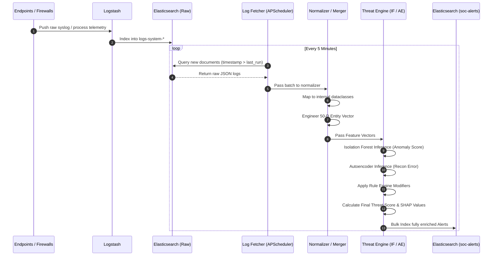
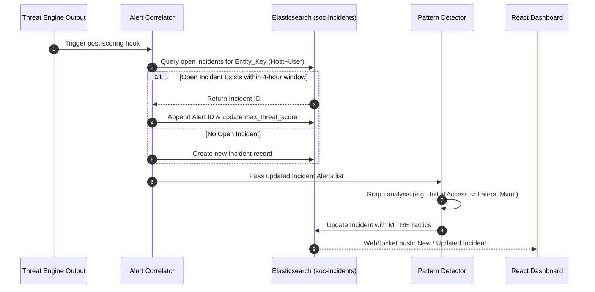
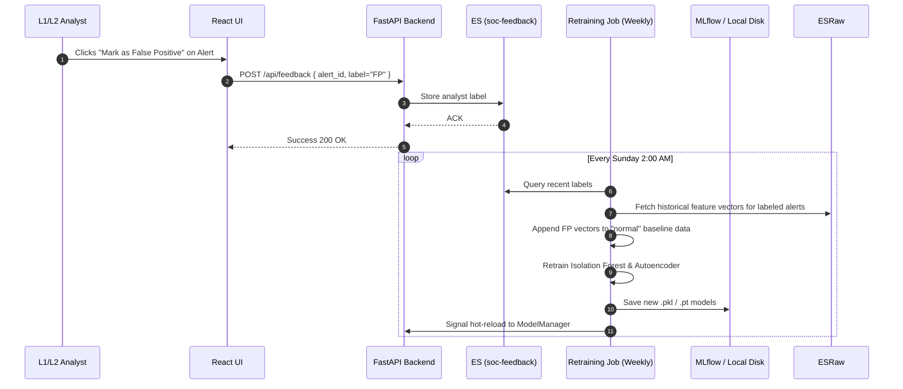
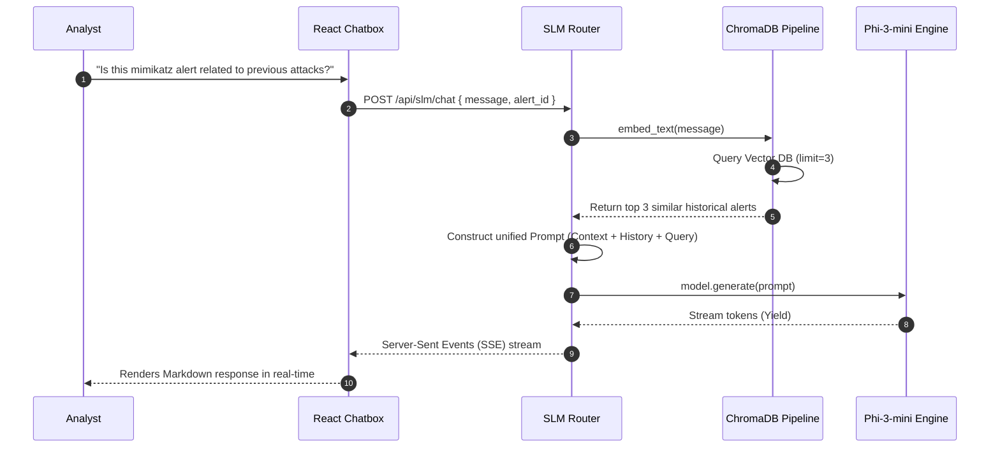

# ISRO ISTRAC SOC AI Platform — Data Flow Diagrams

This document contains detailed sequence diagrams mapping the core logical pathways within the SOC AI Platform. These diagrams are critical for understanding how state propagates between the Python ingestion engine, the Elasticsearch backend, the ML processes, and the React frontend.

---

## 1. Single Log to Alert Flow (Happy Path)
This represents the asynchronous, 5-minute batch pipeline where raw endpoint logs are transformed into mathematically scored threat alerts.

---

## 2. Alert to Incident Correlation Flow
Alerts are often components of a larger attack chain. This flow demonstrates how isolated alerts are clustered temporally and topologically into macro-Incidents.

---

## 3. Analyst Feedback to Retraining Flow
A critical component of reducing false positives is the continuous active learning loop.

---

## 4. SLM Investigation Flow with RAG
When an analyst requires plain-English context regarding a complex alert, the local Small Language Model uses Retrieval-Augmented Generation (RAG) to ensure accuracy and prevent hallucination.

